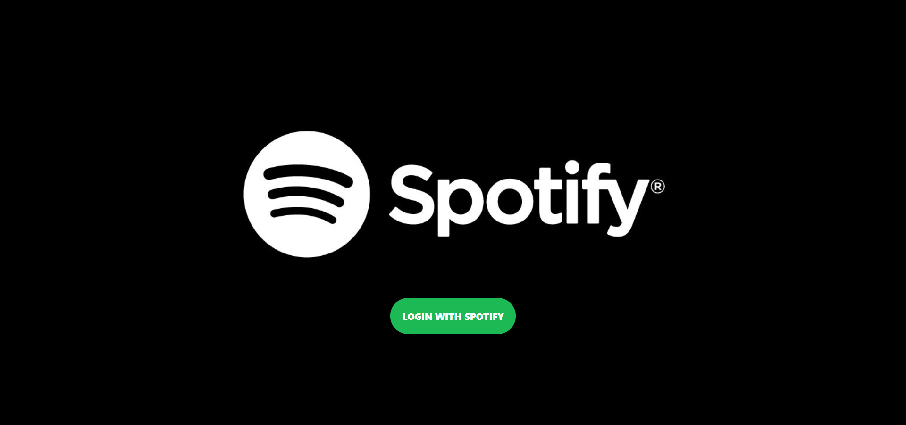
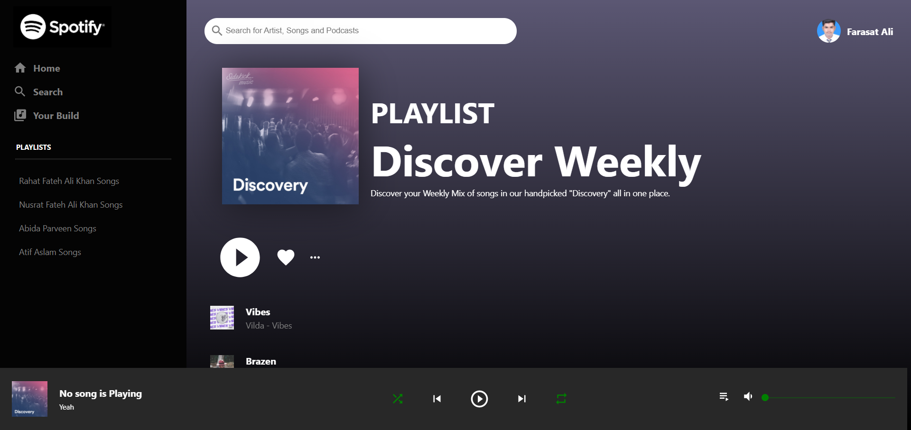

# 👨‍💻 Spotify Clone.
## 📽 A project based on Clever Programmer ReactJS Project Tutorial.

### ⚒ Project Demo:
####  For Project Demo Follow the Link For: 
#### https://react-spotify-copy.netlify.app/

### 🕵️‍♂️ Project Details:
####  This project is based on primarily on React TypeScript as well as uses other libraries too. In this app, you can view Spotify UI!

### ⚙ Technical Details:
#### In this project React with TypeScipt.

### 🤹‍♂️ Skill:
    
    
    

### ✔ Contributers:

  <a href="https://github.com/faraasat">
    &nbsp&nbsp&nbsp&nbsp&nbsp&nbsp&nbsp&nbsp&nbsp&nbsp&nbsp&nbsp
  </a>

### 📷 Project UI:

  <a href="https://react-spotify-copy.netlify.app/">
    &nbsp&nbsp&nbsp&nbsp&nbsp&nbsp&nbsp&nbsp&nbsp&nbsp&nbsp&nbsp
  </a>
  <a href="https://react-spotify-copy.netlify.app/">
    &nbsp&nbsp&nbsp&nbsp&nbsp&nbsp&nbsp&nbsp&nbsp&nbsp&nbsp&nbsp
  </a>
  <a href="https://react-spotify-copy.netlify.app/">
    &nbsp&nbsp&nbsp&nbsp&nbsp&nbsp&nbsp&nbsp&nbsp&nbsp&nbsp&nbsp
  </a>

